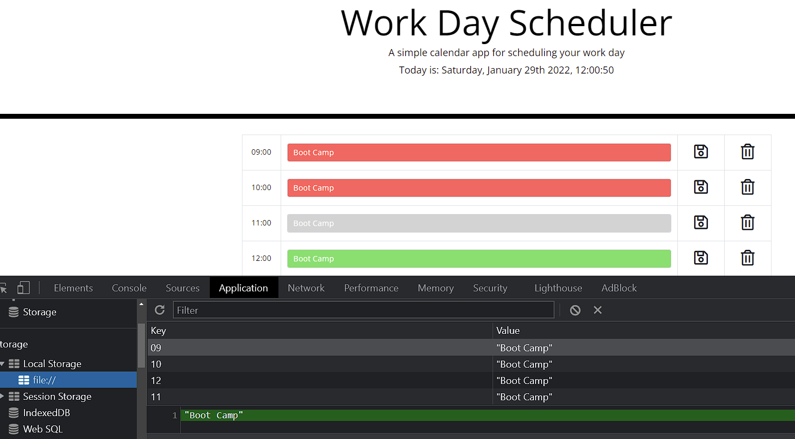

# C-5-Third-Party-APIs_Work-Day-Scheduler

Target goals:

- Create a basic work hours schedule
- Show day and time at the top of the page
- Time blocks with standard business hours
- Color of each row based on time of the day, past=red, present=grey, future=green
- Input for task/event
- add Save button
- add Delete button (bonus)
- Use Local Storage to save the task/event
- Task/events persist after refresh the page

## Application deployed at URL:

https://kakudiego.github.io/C-5-Third-Party-APIs_Work-Day-Scheduler/

## GitHub repository:

https://github.com/kakudiego/C-5-Third-Party-APIs_Work-Day-Scheduler

## ScreenShots:

